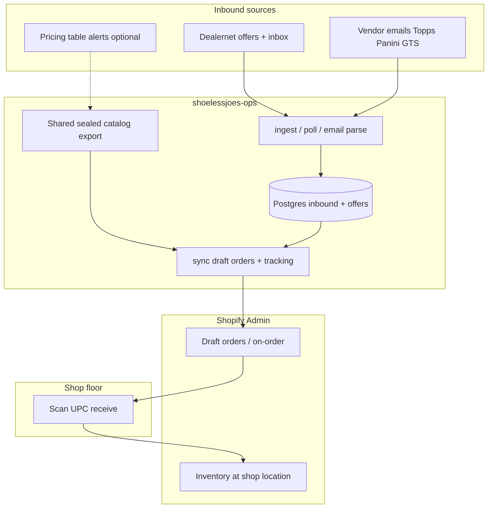

# Agent handoff — inbound inventory & purchasing

**Last updated:** 2026-05-29  
**Audience:** Any agent (Claude Code, Cursor, etc.) picking up back-office work  
**Shop:** Shoeless Joe's Cards — `qebynk-b0.myshopify.com` (public: shoelessjoescards.com)

---

## North star

**One picture of everything coming in or on order**, so staff can **scan UPC → receive → Shopify inventory** without re-keying.

Today purchases are still partly manual when product hits the shop. Automation goal:

```
Sources (Dealernet, vendor email, …)
        ↓
  Normalized “inbound lines” (UPC, qty, cost, status, tracking, vendor)
        ↓
  Match to Shopify catalog (shared sealed-product export — in progress)
        ↓
  Expected inventory / draft PO / on-order queue
        ↓
  Scan-in at receiving → adjust Shopify inventory
```

---

## Repo map

| Repo | Path | Role |
|------|------|------|
| **shoelessjoes-ops** | `C:\Users\burke\Git2\shoelessjoes-ops` | Dealernet ingest, inbox, Shopify draft orders/orders, Postgres, Remix admin (future) |
| **shoelessjoes-supplier-py** | `C:\Users\burke\Git2\shoelessjoes-supplier-py` | Dealernet **pricing table** scrape, margin ranking, price alerts (Windows scheduled) |
| **shoelessjoes-storefront** | `C:\Users\burke\Git2\shoelessjoes-storefront` | Customer theme + PSA form + Apps Script |

**Legacy (archive only):** `dealernet-shopify-ops`, `shoeless-joes`, old Railway project (dead DB URL — do not use).

**Related docs in ops:** `HANDOFF_CLAUDE.md`, `PURCHASE_FLOW.md`, `FIRST_LIVE_RUN.md`, `DATABASE_SETUP.md`, `RAILWAY_FRESH_START.md`

---

## Where we left off (owner session ~2026-05-29)

### Validated locally

- Docker Postgres + Prisma migrations on shop PC  
- Playwright + `ingest-offers` (Dealernet → DB)  
- `poll-messages` (25 inbox rows ingested, bootstrap mode)  
- `report-purchases` — UPC match preview (~21/23 lines on last full batch)  
- `sync-offers purchase` dry-run — **17 purchase offers**, filter fix confirmed  
- Fixes shipped: purchase-only sync filter, multi-UPC cells, sync **summary** header  

### Owner actions (same day)

1. Cleared **completed** Dealernet offers off the board (manual in DealerNet UI)  
2. Re-ran ingest → preview → **live execute** for current purchase (and possibly sale) batch  
3. **Will verify in Shopify Admin tomorrow** — draft orders, line items, tags, gaps  

### Parallel work (another agent)

- **Shared Shopify sealed-product export** (UPC, variant ID, cost, price, inventory, sealed-only filter)  
- Both **ops purchase sync** and **supplier-py pricing match** should consume this when ready — not duplicate live full-catalog fetches  

### Infrastructure

- **Railway:** abandoned for now; local Docker only (`npm run db:up:wait`)  
- **Credentials:** see `shoelessjoes-storefront/docs/CREDENTIALS.md` — never commit `.env`  

---

## Stream A — Dealernet automated purchases & sales

### What exists today

| Job | Purpose |
|-----|---------|
| `job:ingest-offers` | Scrape `PURCHASESUNRATED` + `SALESUNRATED` → Postgres |
| `job:poll-messages` | Inbox → classify; **tracking → offer lines** when parsed |
| `job:report-purchases` | Read-only UPC match report (ACCEPTED purchases) |
| `job:sync-offers purchase` | ACCEPTED buys → Shopify **draft orders** (dry-run default) |
| `job:sync-offers sale` | ACCEPTED sales → Shopify **paid orders** + inventory decrement |
| `job:update-purchase-tracking` | Push tracking onto existing draft orders |

**Purchase path:** offer accepted → draft order (UPC match) → tracking from inbox → draft note/tags updated.  
**Sale path:** higher risk — only automate when intentional.

### Still to do (Dealernet)

| Priority | Task |
|----------|------|
| P0 | **Verify first live run** — Admin draft orders, partial offers (e.g. missing Pokémon UPCs), case-qty skips |
| P0 | Plug in **shared sealed catalog export** when Claude delivers (replace per-run `fetchVariantIndex`) |
| P1 | **Mapping overrides UI** — `apps/web` `app.mapping` for UPC/title mismatches |
| P1 | **Receiving workflow** — link draft order / inbound line → scan UPC → receive inventory in Shopify (not built) |
| P2 | **Scheduled jobs** on shop PC (Task Scheduler) or new Railway cron — see cadence below |
| P2 | **Sale sync policy** — purchases-only automation first; sales manual or separate approval |
| P3 | **Idempotency review** — `alreadySyncedOffers` in sync summary; ensure re-ingest doesn’t duplicate drafts |
| P3 | **Case lines** — re-ingest when `caseQtyBoxes` missing; don’t under-order cases |

### Suggested automation cadence (once trusted)

```
2–4×/day   ingest-offers
1–2×/day   poll-messages
after ingest   sync-offers:purchase (dry-run)
when clean       sync-offers -- purchase --execute --no-create-missing
when tracking    update-purchase-tracking --execute
```

Avoid full `dealernet-cycle` with auto-execute on **sales** until purchase path is stable.

### Key commands

```powershell
cd C:\Users\burke\Git2\shoelessjoes-ops
npm run db:up:wait          # if Docker not running
npm run job:ingest-offers
npm run job:poll-messages
npm run job:report-purchases
npm run job:sync-offers:purchase
npm run job:sync-offers -- purchase --execute --no-create-missing
npm run job:update-purchase-tracking -- --execute
```

---

## Stream B — Vendor email invoices (not built yet)

### Vendors

| Vendor | Typical flow | Email signals |
|--------|----------------|---------------|
| **Topps.com** | Offer/cart → order confirm → invoice → shipped | Order #, line items, tracking |
| **Topps Direct** | Same family, may differ templates | PDF invoice, shipping notice |
| **Panini** | Order → invoice → shipped | PDF + HTML order emails |
| **GTS Distribution** | Wholesale order → invoice → ship | PDF invoices, SKU/UPC tables |

Owner note: these often start as **offers**, become **orders**, then **invoiced/shipped** — similar lifecycle to Dealernet but sourced from **email**, not DealerNet scrape.

### Existing seed (supplier-py)

- `integrations/google_apps_script/log_vendor_invoices.gs` — Gmail label → Drive PDF + Sheet row  
- Pattern: label per vendor (`Invoices/VendorA`), time-driven trigger, dedupe by `gmail_message_id`  
- **Not wired to ops Postgres or Shopify yet**

### Recommended approach (phased)

#### Phase 1 — Email capture (low risk)

- Gmail filters + labels: `Invoices/Topps`, `Invoices/ToppsDirect`, `Invoices/Panini`, `Invoices/GTS`  
- Extend Apps Script (or one script, vendor param) → Sheet or webhook → **ops DB**  
- Store raw: `vendor`, `message_id`, `subject`, `date`, `attachment_urls`, `parse_status=new`  
- Deliverable: nothing lost in inbox; ops can see “unparsed invoice” queue  

#### Phase 2 — Parse → normalized lines

Per-vendor parsers (PDF text or HTML body):

- Extract: `order_id`, `invoice_id`, `line_items[]` { sku, upc, title, qty, unit_cost }, `tracking`, `ship_date`, `status`  
- Start with **one vendor** (simplest PDF — often GTS or Topps)  
- Output: same shape as Dealernet offer lines where possible:

```
vendor_source   (dealernet | topps | panini | gts)
external_id     (order or invoice #)
status          (ordered | invoiced | shipped | received)
upc, title, qty, unit_cost, tracking
```

#### Phase 3 — Unified inbound model (Postgres)

Add tables (names illustrative):

- `InboundShipment` — vendor, external order id, status, tracking, expected date  
- `InboundLine` — upc, qty, cost, matched_variant_id, receipt_status  

Reconcile:

- Dealernet **offer id** ↔ vendor **order id** when both exist (same UPC/qty/date heuristic)  
- Deduplicate so one physical shipment = one inbound record  

#### Phase 4 — Shopify + receiving

- Match lines via **shared sealed catalog** (UPC → variant id)  
- Create/update **draft purchase orders** or **inventory transfers** (policy TBD with owner)  
- **Scan-in UI or workflow:** scan UPC → find open inbound line → increment Shopify inventory at location `72115847233` → mark line received  

#### Phase 5 — “Everything on order” dashboard

Single view (Remix admin or Sheet):

| Source | Vendor | Status | # lines | Tracking | Shopify draft |
|--------|--------|--------|---------|----------|---------------|
| Dealernet | NC-LIVE | accepted | 3 | — | draft #123 |
| Topps Direct | — | shipped | 12 | 1Z… | — |
| GTS | — | invoiced | 5 | — | pending parse |

Owner goal: **scan and receive without looking up three systems**.

### Open questions for owner (agent should confirm)

1. Receive into Shopify via **draft order complete**, **inventory adjust**, or **purchase order app**?  
2. Store **cost** on variant/inventory item metafield when receiving?  
3. Which vendor email to parse **first** (highest volume)?  
4. Keep Google Sheet as staging or **Postgres-only** after Phase 1?  

---

## Stream C — Pricing / buy-side intelligence (supplier-py)

Separate from **fulfillment**:

- Scrapes Dealernet **pricing table** (not offer list)  
- Ranks margin / restock / raise / lower; submits **price alerts** on Dealernet  
- Windows Task Scheduler: daily / OOS / weekly profiles  

**Consolidation:** evaluate Claude’s Shopify integration vs maintaining Python REST client — pick one for catalog fetch + match.

---

## End-to-end picture (target architecture)



---

## Agent session bootstrap (paste this)

```
Read C:\Users\burke\Git2\shoelessjoes-ops\docs\AGENT_HANDOFF.md first.

Context: Dealernet ops runs locally (Docker Postgres). Owner completed first live
purchase sync after clearing old offers — VERIFY Shopify draft orders tomorrow.
Claude is building shared sealed-product Shopify export.

Dealernet next: verify live run, catalog integration, mapping overrides, receiving workflow, schedules.

New stream: vendor email invoices (Topps.com, Topps Direct, Panini, GTS) — Phase 1 Gmail→DB,
Phase 2 parse PDFs, Phase 3 unified inbound model, Phase 4 scan-to-receive.

Do not use old Railway DATABASE_URL. Shop domain: qebynk-b0.myshopify.com
```

---

## File index (ops)

| Topic | Path |
|-------|------|
| Dealernet jobs detail | `docs/PURCHASE_FLOW.md` |
| First live cutover | `docs/FIRST_LIVE_RUN.md` |
| Claude-specific notes | `docs/HANDOFF_CLAUDE.md` |
| Local DB | `docs/DATABASE_SETUP.md` |
| Offer scrape | `packages/core/src/dealernet/offers.ts` |
| Inbox + tracking | `packages/core/src/dealernet/messages.ts`, `tracking.ts`, `poll-messages` job |
| UPC match | `packages/core/src/mapping.ts` |
| Shopify sync | `packages/core/src/shopify-sync.ts` |
| Email invoice seed | `../shoelessjoes-supplier-py/integrations/google_apps_script/` |

---

## What not to do

- Do not point local `.env` at dead Railway Postgres  
- Do not run `sale --execute` without explicit owner approval (inventory impact)  
- Do not duplicate catalog export logic in three places once shared export exists  
- Do not commit secrets or `.env` files  
