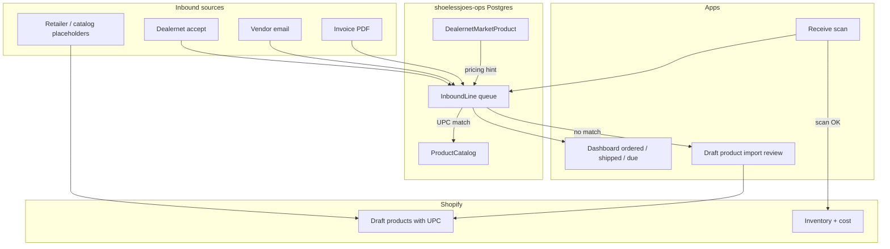

# Inbound ops handoff — market search, sync lessons, unified pipeline

**Last updated:** 2026-06-17  
**Audience:** Agents, contractors, or staff picking up back-office / receiving work.  
**Repos:** `shoelessjoes-ops` (Node + Postgres + Remix) · `shoelessjoes-supplier-py` (Python + Playwright)

> Cross-repo overview: `SHOELESS_JOES_MASTER.md`  
> Day-to-day ops jobs: `AGENT_HANDOFF.md` · `RUNBOOK.md` · `WORK_QUEUE.md`

---

## North star

**One picture of everything on order or in transit**, so staff can **scan UPC → receive → adjust Shopify inventory** without re-keying. Sources include Dealernet purchases, vendor email, and invoice PDFs — all on the **same inbound row shape**.

**Shopify’s job:** catalog (draft or active products with UPC), inventory, unit cost.  
**Postgres’s job:** what was ordered, how many, cost, tracking, stage, what’s left to receive.

---

## Target model (one pipeline, many sources)

Every inbound channel normalizes to the same row:

```text
source              dealernet | vendor_email | vendor_pdf | retailer_feed | …
external_id         offer #366800 | invoice # | email message id
upc                 primary match key
title               human-readable product name
qty_ordered         how many you bought
qty_received        filled at scan time (0 until received)
unit_cost           from offer / invoice line
stage               ordered → shipped → in_transit → delivered → received
tracking            when available
shopify_variant_id  matched draft/active product (null until created)
```

### Draft product vs draft order

| Concept | Meaning |
|---------|---------|
| **Draft product** | SKU exists in Shopify (`status: draft`), UPC on variant — placeholder until you’re ready to sell |
| **Inbound line** | “We ordered 3 @ $245, tracking 1Z…, 0 received” — lives in Postgres, not Shopify drafts |
| **Draft order** | Outbound sales document — correct for **Dealernet sales**, not for **inbound purchases** |

### Intended flow

```text
Retailer feed / Matrixify / draft import tool (PSA-style review UI)
  → Shopify draft product with UPC (placeholder price optional)

Dealernet accept OR vendor invoice parsed
  → Match UPC → existing variant
  → Create inbound line (qty, cost, tracking, stage)
  → Write cost to variant when known

No Shopify match?
  → Queue for review (CSV or import UI)
  → On approve → create draft product → link inbound line
```

---

## What was built (2026-06-17 session)

### shoelessjoes-supplier-py

| Piece | Path / command |
|-------|----------------|
| Shared Dealernet search + priceguide scrape | `src/dealernet_search.py` |
| Parsed box batch search | `scripts/search-parsed-boxes.py` |
| Arbitrary name/UPC list resolver | `scripts/resolve-market-list.py` |
| Title formatting from rough inventory CSV | `scripts/strict-fuzzy-market-match.py` |
| Formatted input (358 rows) | `data/parsed_boxes_formatted.csv` |
| Sample list for testing | `data/market_list_sample.txt` |

**Search run:** 348 unique queries → ~158 with Dealernet high buy / low sell (`out/parsed_boxes_search_cache.csv`, gitignored).

**Why live search:** Fuzzy match against `supplier_daily.csv` picked wrong years (e.g. 2026 instead of 2018) because daily scrape only has in-stock UPCs.

```powershell
cd shoelessjoes-supplier-py
.\.venv\Scripts\python.exe scripts\search-parsed-boxes.py
.\.venv\Scripts\python.exe scripts\resolve-market-list.py --input data\my_list.txt
```

### shoelessjoes-ops

| Piece | Path / command |
|-------|----------------|
| Market reference table | `DealernetMarketProduct` in Prisma |
| Import market CSVs → Postgres | `npm run job:import-market-catalog` |
| Market lookup UI | `/app/market` |
| Market lookup API | `/app/api/market?q=…` or `?upc=…` |
| Migration | `packages/db/prisma/migrations/20260617120000_dealernet_market_product/` |

**Import sources:** `../shoelessjoes-supplier-py/out/market_resolve_cache.csv`, `parsed_boxes_search_cache.csv`, `supplier_daily.csv`.

**Git commits pushed:** supplier-py `ad33de0` · ops `5c3aab2`

---

## Sync-offers: what happened and what’s wrong

### Current code behavior (inverted vs intent)

| `sync-offers` mode | Dealernet queue | Shopify creates today | Should be |
|--------------------|-----------------|----------------------|-----------|
| `purchase` | `PURCHASESUNRATED` | **Draft orders** | **Inbound line** in Postgres (+ optional cost on variant) |
| `sale` | `SALESUNRATED` | **Paid orders** + inventory decrement | **Draft orders** (outbound, ship later) |

### First live purchase execute (2026-06-17)

Pipeline: `ingest-offers` → `poll-messages` → `job:sync-offers:purchase:execute`

| Result | Count |
|--------|------:|
| Shopify draft orders created | 10 |
| Skipped (no mappable lines) | 2 |
| Offers in DB at run time | 12 accepted, 14 lines |

**Draft IDs created:** 1024105742401, 1024105807937, 1024105840705, 1024105873473, 1024105906241, 1024105939009, 1024105971777, 1024106004545, 1024106037313, 1024106070081

Tags: `dealernet`, `purchase`, `offer-{id}`. Line items / UPC matching looked good; **document type was wrong** for inbound buys. Some **sales** (`to … (For Sale)`) were mixed into the purchase queue.

**Re-runs:** Those 10 offer IDs are in `ShopifySyncEvent` with `status: created` — execute will not duplicate them.

**Cleanup:** Delete wrong drafts in Shopify Admin → Orders → Drafts (especially outbound sales). Completing a draft increases inventory — don’t complete drafts for stuff already received manually.

### Dry run vs execute (purchases)

| Mode | Creates in Shopify? | Inventory impact |
|------|---------------------|------------------|
| Dry run (default `job:sync-offers:purchase`) | No | None |
| Execute | Real **draft orders** | None until draft is **completed** in Admin |

### Tracking

- Tracking is copied into draft **notes** when present in Postgres — sync does **not** skip tracked offers.
- After ingest/poll on 2026-06-17, **0 offers had tracking in DB** (may differ on Dealernet UI until scrape improves).

---

## Shopify purchase orders, Matrixify, transfers

| Tool | Use for purchases? |
|------|-------------------|
| **Shopify Purchase Orders (Admin UI)** | No public API to create POs programmatically |
| **Matrixify** | Bulk **products** (UPC, cost, price) — not POs, transfers, or inbound dashboard |
| **Inventory Transfers API** | Optional: `inventoryTransferCreate` + `inventoryShipmentReceive` for multi-location receive semantics |
| **Single location** | Simpler: `inventoryAdjustQuantities` on receive scan |

**Recommended purchase path:** Postgres inbound queue + receive scan + inventory adjust — not draft orders, not PO API.

---

## Unified architecture (target)



### Channel ingest (same `InboundLine`)

| Source | Ingest | Tracking |
|--------|--------|----------|
| Dealernet | `ingest-offers` + accept | `poll-messages`, offer detail |
| Email / PDF | Gmail / Apps Script / worker (planned) | Email body, carrier APIs later |
| Placeholder catalog | Matrixify or draft import UI | N/A |

**Existing starters:** `shoelessjoes-supplier-py/integrations/google_apps_script/log_vendor_invoices.gs`, `docs/google-workspace-automation-starter.md`, `docs/dealernet-intake-starter.md` (supplier-py). **DA Card World catalog scrape:** `docs/DACARDWORLD_CATALOG.md`.

**Graded-card import pattern:** `shoelessjoes-storefront` PSA form + `GRADED_CARDS.md` — reuse review → create draft products UX for **sealed wax** (UPC, sport, year, box type).

---

## Receive scan (target UX)

1. Scan UPC (or type name) on tablet/phone (`/app/receive` — not built yet).
2. Query **open inbound lines** for that UPC.
3. Show: `Offer #366800 — Bowman Hobby — expect 2, received 0`.
4. Tap OK (or scan same box N times).
5. `inventoryAdjustQuantities` in Shopify; increment `qty_received` in Postgres.
6. When `qty_received >= qty_ordered` → `stage: received` → off dashboard.

POS native scan won’t show Dealernet context without a POS UI extension; sidecar receive app is fine for v1.

---

## Ops pipeline (running today)

| Job | Cadence | Purpose |
|-----|---------|---------|
| `run-active-stock.ps1` | 3×/day | ingest → poll → purchase dry-run |
| `run-catalog-export.ps1` | Weekly | Shopify sealed catalog + UPC tiers |
| `run-dealernet-pricing.ps1` | Daily | Dealernet pricing vs Shopify |
| `job:import-market-catalog` | After search scrape | Market reference → Postgres |

**Other fixes this period:** ingest prune (stale offers), SMS bounce loop disabled, offer page / work-queue docs.

---

## Next-agent backlog (priority)

| P | Task |
|---|------|
| 1 | ~~**Fix sync semantics**~~ — **done** purchases → InboundLine + cost; sales → draft orders |
| 2 | ~~**`InboundLine` table**~~ — **done** (`20260617140000_inbound_line`); sync runs after `ingest-offers`; `InboundShipment` deferred |
| 3 | ~~**On purchase accept → inbound line**~~ — **done** for Dealernet ACCEPTED unrated; UPC match + cost on variant still manual |
| 4 | **Draft sealed-product import UI** — PSA/graded-card-style review; CSV → approve → draft products |
| 5 | **Retailer placeholder feed** (optional) — pre-build draft products with UPC (`DACARDWORLD_CATALOG.md`) |
| 6 | **Vendor email/PDF** — parse → same `InboundLine` (Topps, Panini, GTS, …) |
| 7 | ~~**Dashboard**~~ — **read-only** `/app/queue`; receive scan + filters still to build |
| 8 | ~~**Receive scan**~~ — **v1** `/app/receive` (UPC → inventory adjust + mark received) |
| 9 | Review `no_results` from market search (~188 queries) — typos, alternate search strings |
| 10 | UPS tracking merge (planned in `WORK_QUEUE.md`) |

---

## Quick commands

```powershell
# Ops — refresh Dealernet + poll
cd shoelessjoes-ops
npm run job:ingest-offers
npm run job:poll-messages
npm run job:report-purchases

# Purchase sync (current behavior — creates draft orders; pending redesign)
npm run job:sync-offers:purchase              # dry-run
npm run job:sync-offers:purchase:execute      # live drafts

# Market DB
npm run job:import-market-catalog

# Supplier-py — resolve rough list
cd ..\shoelessjoes-supplier-py
.\.venv\Scripts\python.exe scripts\resolve-market-list.py --input data\my_list.txt
```

---

## Session bootstrap (paste to next agent)

```text
Read shoelessjoes-ops/docs/INBOUND_OPS_HANDOFF.md (this file), then AGENT_HANDOFF.md and WORK_QUEUE.md.

Built: Dealernet live keyword search (supplier-py), DealernetMarketProduct + import + /app/market.
First live purchase sync created 10 Shopify draft orders — WRONG doc type for inbound; sales should
use drafts, purchases should use InboundLine + receive scan. Clean up drafts in Admin.

Linchpin: unified InboundLine for Dealernet + vendor email/PDF; draft Shopify products with UPC as
placeholders (PSA-style import UI for sealed wax); scan receive → inventory adjust.

Shop: qebynk-b0.myshopify.com. Do not use dead Railway DATABASE_URL. Do not run sale --execute
without approval (paid orders + inventory decrement).
```

---

## Current state (honest)

| Area | Status |
|------|--------|
| Dealernet ingest + poll | Working |
| Market price lookup (search + Postgres) | Working |
| UPC match to Shopify catalog | Working |
| Purchase → Shopify | Wrong model (draft orders); needs inbound queue |
| Sale → Shopify | Wrong model (paid orders); should be drafts |
| Inbound dashboard | Not built |
| Receive scan | Not built |
| Vendor email/PDF pipeline | Starters only |
| Draft product import (sealed) | Not built (pattern exists for graded cards) |

---

## What not to do

- Do not run `sale --execute` without explicit approval (paid orders, inventory decrement).
- Do not rely on purchase draft orders for inbound receiving long term.
- Do not expect Matrixify to manage transfers or purchase orders.
- Do not commit `.env` or secrets.
- Re-run `db:migrate:deploy` on production after pulling ops `5c3aab2` for `DealernetMarketProduct`.
