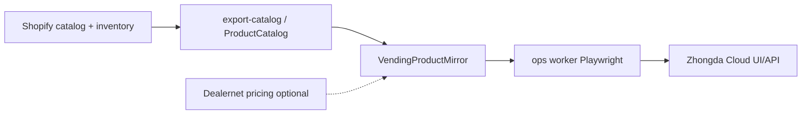

# Zhongda Cloud vending integration

**Portal:** https://us.zhongdacloud.com/web/#/login  
**Config (selectors only):** `configs/zhongda.vending.json`  
**Credentials:** `ZHONGDA_USERNAME` / `ZHONGDA_PASSWORD` in `apps/worker/.env`

---

## Problem

- Vending backend is a Chinese cloud UI; **CSV product import reportedly broken**.
- Today: stock machines by **deducting Shopify inventory** manually.
- Pain: **prices drift** (e.g. Pokémon packs appreciate in the machine); new Shopify SKUs/UPCs are not mirrored in Zhongda.
- Goal: mirror Shopify catalog → Zhongda, automate price updates where possible, show **live Shopify qty** next to machine stock, tie into Dealernet pricing checks later.

---

## What exists now (Phase 1)

| Command | Purpose |
|---------|---------|
| `npm run job:vending-probe-login` | Verify login + screenshot |
| `npm run job:vending-probe-login -- --headed` | Visible browser; fix submit selector if needed |
| `npm run job:vending-diagnose-import -- --headed --observe-ms 180000` | Capture API traffic while you try CSV import |
| `npm run job:vending-sync-shopify-mirror` | Copy `ProductCatalog` → `VendingProductMirror` in Postgres |

**Login selectors (confirmed):**

- Username: `#normal_login_username`
- Password: `#normal_login_password`
- Submit: **not** `.ant-message` (that is a toast container). Config tries `button.ant-btn-primary` etc.

---

## Setup

1. Copy env template:

```powershell
# apps/worker/.env
ZHONGDA_USERNAME=your_user
ZHONGDA_PASSWORD=your_pass
```

2. Migrate DB (adds `VendingProductMirror`):

```powershell
npm run db:migrate
```

3. Test login (note the `--` before `--headed` — required so npm passes flags to the script):

```powershell
npm run job:vending-probe-login -- --headed
```

Or set `ZHONGDA_HEADED=1` in `apps/worker/.env` and run without flags.

4. Diagnose CSV import (you operate the UI; we log network):

```powershell
npm run job:vending-diagnose-import -- --headed --observe-ms 180000
```

Open **Product / Import** in the portal, upload the same CSV that fails, then check:

`data/vending-probes/network-*.jsonl` — look for `4xx`/`5xx`, validation errors in JSON bodies, or missing `multipart` upload endpoints.

---

## Architecture (target)



| Phase | Work |
|-------|------|
| **1** (now) | Login probe, import network diagnose, Shopify mirror table |
| **2** | Discover product list + create/update APIs or form automation after login |
| **3** | Push price/qty from mirror when Shopify or Dealernet suggests change |
| **4** | Remix admin: machine stock vs `shopifyQty`, restock queue |
| **5** | TCGplayer bridge for Pokémon machine SKUs |

---

## CSV import (diagnosed 2026-06-03)

Import is **not** silently broken — the API returns a clear validation error.

| Item | Value |
|------|--------|
| Endpoint | `POST https://us.zhongdacloud.com/sapi/goods/importGoods` |
| Failure seen | `code: 1` — *"The number of data columns is less than 3: please fill in the goods data"* |
| Fix | CSV must have **at least 3 data columns** per row (check delimiter, header row, empty rows). Use **Export** on Goods list in the portal as the template if available. |

After login, open **Products → Goods list** (`#/goods` / alias `goods.index`).

## Product API (for automation)

| Endpoint | Purpose |
|----------|---------|
| `GET /sapi/goods?page=1` | List products (`id`, `goods_name`, `goods_no`, `cost_price`, `sell_price`, `market_price`, `category_name`, …) |
| `GET /sapi/goods/options` | Categories, units, brands |
| `POST /sapi/goods/importGoods` | CSV import (multipart file) |
| `POST /sapi/auth/login` | `username` + `password` → `bearer` JWT token |

Price updates will likely be a separate `PUT`/`POST` on a single goods id — capture that on the next diagnose run by editing one product’s sell price while the logger runs.

## Security

- Never commit `ZHONGDA_*` or paste passwords into chat/config files.
- Probe screenshots may show account UI — `data/vending-probes/` is gitignored.
- Older network logs may contain login POST bodies — delete `data/vending-probes/network-*.jsonl` after review; future runs redact credentials.

---

## Relation to other repos

- **shoelessjoes-ops** — vending + Dealernet + Shopify (this doc).
- **shoelessjoes-supplier-py** — Dealernet price alerts; can feed “raise price” hints into vending mirror later.
- **Railway** — optional cron for `vending-sync-shopify-mirror` + future Zhongda push jobs.
