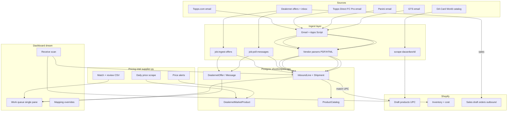

# Vendor channels + unified dashboard roadmap

**Last updated:** 2026-06-17  
**Owner goal:** One dashboard for everything on order, in transit, or due — Dealernet, Topps, Panini, GTS, email invoices, shipping — tied to Shopify draft products (UPC) and receive scan.

Related docs:
- `INBOUND_OPS_HANDOFF.md` — inbound row model, sync lessons, receive scan
- `DACARDWORLD_CATALOG.md` — draft product placeholders (UPC ahead of orders)
- `WORK_QUEUE.md` — queue exit rules
- `AGENT_HANDOFF.md` — ops jobs and streams
- `../shoelessjoes-supplier-py/docs/google-workspace-automation-starter.md` — Gmail → Sheet pattern
- `../shoelessjoes-supplier-py/integrations/google_apps_script/log_vendor_invoices.gs` — Apps Script seed

---

## The one model (all sources)

Every channel normalizes to **`InboundLine`** (+ optional **`InboundShipment`** for tracking):

```text
source           dealernet | topps_com | topps_direct | panini | gts | dacardworld | …
external_id      offer # | order # | invoice # | PO #
vendor_order_id  their order reference
invoice_id       when invoiced
direction        inbound | outbound
stage            ordered | confirmed | invoiced | awaiting_ship | in_transit | delivered | received | cancelled
title            product name
upc              match key
vendor_sku       when UPC missing
qty_ordered
qty_received
unit_cost
tracking
carrier
expected_date    release / ship / delivery
shopify_variant_id
raw_ref          message id, PDF drive id, scrape url
parse_confidence 0-100
```

**Shopify:** draft/active **products** (UPC) via DA Card World / Matrixify / import UI.  
**Not Shopify PO API:** on-order state lives in **Postgres** until receive scan adjusts inventory.

---

## Full platform map



---

## What’s already running

| Area | Status | How to run |
|------|--------|------------|
| Dealernet offer ingest | ✅ Built | `npm run job:ingest-offers` |
| Dealernet inbox + classify | ✅ Built | `npm run job:poll-messages` |
| Dealernet purchase sync | ⚠️ Wrong doc type (draft orders) | `npm run job:sync-offers:purchase` — redesign → `InboundLine` |
| Dealernet sale sync | ⚠️ Paid orders today | Should → draft orders |
| Dealernet market prices | ✅ Built | supplier-py search + `job:import-market-catalog` |
| Dealernet pricing scrape | ✅ Built | `run-dealernet-pricing.ps1` |
| Dealernet price alerts | ✅ Built | supplier-py `add-alerts` |
| Shopify catalog export | ✅ Built | `job:export-catalog` weekly |
| Vendor email capture | 🟡 Starter only | Apps Script `log_vendor_invoices.gs` |
| Topps / Panini / GTS parsers | ❌ Not built | Per-vendor Phase 2 |
| `InboundLine` table | ❌ Not built | Prisma migration needed |
| DA Card World scrape | ❌ Spec only | `DACARDWORLD_CATALOG.md` |
| Unified dashboard | ❌ Not built | Remix `/app` queues |
| Receive scan | ❌ Not built | `/app/receive` |

**Schedules:** `.\scripts\ops\register-scheduled-tasks.ps1` (active stock 3×/day, pricing daily, catalog weekly).

---

## Vendor channels — how to get each running

All four wholesalers primarily arrive via **email** (order confirm → invoice PDF → shipped/tracking). FC Pro / Topps Direct is the **dealer portal**; orders still usually email you confirmations and PDFs.

### Phase 1 — Email capture (all vendors, low risk)

**Goal:** Nothing lost; every invoice/shipping email logged with PDF in Drive and row in DB/Sheet.

#### Step 1 — Gmail filters + labels

Create filters in the mailbox that receives vendor mail (often `orders@` or main shop Gmail):

| Label | Suggested filter hints |
|-------|------------------------|
| `Invoices/Topps` | `from:(topps.com OR notifications.topps.com)` |
| `Invoices/ToppsDirect` | `from:(toppsdirect.com OR fcpro OR "Topps Direct")` — adjust to actual sender |
| `Invoices/Panini` | `from:(paniniamerica.net OR panini.com)` |
| `Invoices/GTS` | `from:(gtsdistribution.com OR "GTS Distribution")` |
| `Invoices/Dealernet` | optional duplicate of inbox if not using poll-only |

Also label **Shipping/** variants if ship notices use different subjects (`Shipped`, `Tracking`, `On the way`).

#### Step 2 — Clone Apps Script (one script, four vendors)

Base: `shoelessjoes-supplier-py/integrations/google_apps_script/log_vendor_invoices.gs`

For each vendor, duplicate constants:

```javascript
// Topps.com example
const VENDOR_LABEL_NAME = "Invoices/Topps";
const VENDOR_NAME = "topps_com";
const VENDOR_FOLDER_NAME = "Topps_Invoices_Raw";
```

Run on time-driven trigger: **every 15 minutes**.

Sheet tab `raw_email_invoices` columns (already documented):

`created_at | vendor | gmail_message_id | gmail_thread_id | email_from | email_subject | email_date | attachment_file_ids | notes | status`

Status: `raw_saved` → `parsed` | `error`

#### Step 3 — Bridge Sheet → Postgres (ops worker)

Add job `job:import-vendor-emails`:

- Read Sheet via Google Sheets API **or** webhook POST from Apps Script
- Upsert `VendorEmailRaw` (or write directly to staging for parsers)
- Dedupe on `gmail_message_id`

**Alternative:** Skip Sheet long-term; Apps Script POSTs JSON to ops API endpoint with PDF base64 or Drive file ID.

#### Step 4 — Verify capture before parsing

Forward 2–3 real emails per vendor into test labels; confirm PDFs in Drive and rows in Sheet/DB.

---

### Phase 2 — Parse → InboundLine (per vendor)

Build **one parser module per vendor** — do not force one PDF layout. Suggested order:

| Order | Vendor | Why first |
|-------|--------|-----------|
| 1 | **GTS** | Wholesale PDFs often tabular (SKU, UPC, qty, price) |
| 2 | **Panini** | High volume; similar PDF patterns |
| 3 | **Topps.com** | Order + ship emails |
| 4 | **Topps Direct / FC Pro** | May share Topps templates; separate `source` tag |

#### Parser output (same for all)

```json
{
  "source": "gts",
  "external_id": "SO-123456",
  "invoice_id": "INV-789",
  "event_type": "invoice",
  "order_date": "2026-06-10",
  "lines": [
    { "upc": "887521088034", "vendor_sku": "...", "title": "...", "qty": 6, "unit_cost": 245.00 }
  ],
  "tracking": null,
  "ship_date": null,
  "parse_confidence": 92
}
```

`event_type`: `order_confirm` | `invoice` | `shipment` | `cancellation`

**Tech options:**

| Approach | Pros | Cons |
|----------|------|------|
| **pdf-parse + regex/tables** in Node worker | Same repo as ops | Brittle per layout change |
| **Claude/GPT PDF extraction** | Fast to ship | Cost; validate confidence |
| **Make.com / Zapier** | No code | Another subscription; `google-workspace-automation-starter.md` pattern |
| **Dedicated microservice** | Clean | Extra deploy |

Start with **GTS**: collect 5 sample PDFs → build extractor → `job:parse-vendor-email --vendor gts`.

#### Shipment / tracking emails

Separate lightweight parsers for HTML ship notices:

- Extract `tracking_number`, `carrier`, `order_id` from subject/body
- **Update existing** `InboundLine` / `InboundShipment` by `external_id` — don’t create duplicate lines

---

### Phase 3 — Topps Direct (FC Pro) specifics

FC Pro is the **dealer ordering portal** (presells, allocations). Usually:

- You place order in portal
- Email confirm + invoice PDF (same pipeline as above, `source: topps_direct`)
- Optional **future:** Playwright login to FC Pro order history if emails are incomplete

**Do not scrape FC Pro until email path works** — portal auth + anti-bot is heavier.

**Env (when scraping later):** `TOPPS_DIRECT_USERNAME`, `TOPPS_DIRECT_PASSWORD` in worker `.env` (never commit).

---

### Phase 4 — Reconcile with Dealernet

Same UPC + qty + date window → link rows:

```text
Dealernet offer #366800  ↔  GTS order SO-123 line 2  (same UPC, same qty)
```

Dashboard shows one logical shipment; `source` can be `dealernet` primary with `linked_sources` JSON.

---

## Dealernet automation checklist (complete stack)

| Capability | Status | Command / location |
|------------|--------|-------------------|
| Offers ingest | ✅ | `job:ingest-offers` |
| Inbox poll + tracking | ✅ | `job:poll-messages` |
| Offer Accepted / Declined classify | ✅ | `classify.ts` + digest |
| Messaging / email digest | ✅ | worker notifications |
| Purchase → Shopify | ⚠️ Redesign | → `InboundLine` not draft orders |
| Sale → Shopify | ⚠️ Redesign | → draft orders not paid orders |
| Price scrape vs Shopify | ✅ | `run-dealernet-pricing.ps1` |
| Price alerts submit | ✅ | supplier-py `add-alerts` |
| Review / restock ranking | ✅ | `matches_daily.csv`, `out/review/` |
| Market reference by UPC/name | ✅ | `DealernetMarketProduct`, `/app/market` |
| Pending In/Out on dashboard | ❌ | ingest `PENDINGIN` / `PENDINGOUT` |
| UPS tracking merge | ❌ | planned in `WORK_QUEUE.md` |

**Daily ops script:**

```powershell
cd shoelessjoes-ops
.\scripts\ops\run-active-stock.ps1          # ingest + poll + dry-run
.\scripts\ops\run-dealernet-pricing.ps1 -Profile daily -IncludeReview
```

---

## Matrixify / PO workaround (recap)

| Need | Tool |
|------|------|
| Bulk **draft products** with UPC (DA feed, placeholders) | **Matrixify Products import** or Admin API |
| **On order** qty, cost, tracking | **Postgres `InboundLine`** — not Matrixify |
| Shopify **Purchase Orders** | No public API — don’t wait on Matrixify for this |
| **Receive** at shop | Receive scan → `inventoryAdjustQuantities` |

Matrixify is catalog prep; vendor email + Dealernet feed the **inbound queue**.

---

## Dashboard (“nifty” single pane)

Target route: **`/app/queue`** or expand **`/app`** home.

### Queue columns (unified)

| Queue | Filter | Exit when |
|-------|--------|-----------|
| Pending In | Dealernet `PENDINGIN` | You accept/decline |
| Purchases inbound | `InboundLine` inbound + not received | Received scan |
| Sales outbound | Dealernet sales ACCEPTED + vendor outbound | Shipped + paid |
| Awaiting tracking | `stage` ordered/confirmed, no tracking | Tracking ingested |
| In transit | tracking set, not delivered | Carrier delivered / manual |
| Ready to receive | delivered or at shop | Scan complete |
| Pricing actions | `PriceRecommendation` / review CSV | Price updated |
| Parse review | `parse_confidence < 80` | Human fix |
| Missing Shopify product | UPC no variant | Draft created / mapped |

### Row shape in UI

```text
[source badge] [stage] Title · UPC · qty · cost · tracking · expected date · [Open in Dealernet/vendor]
```

Click → detail drawer: linked emails, PDF, offer page, Shopify variant, market high buy / low sell.

### Build order for dashboard

1. `InboundLine` + `InboundShipment` Prisma models
2. Dealernet accept → insert inbound lines (replace purchase draft sync)
3. Vendor email Phase 1 → visible as “unparsed” queue
4. Vendor parsers → lines appear in same queues
5. `/app/queue` with filters
6. Receive scan clears rows
7. Pricing / restock widgets as secondary panels

---

## Implementation timeline (suggested)

| Week | Focus |
|------|--------|
| 1 | `InboundLine` schema; fix Dealernet → inbound not drafts; sale → draft orders |
| 1 | Gmail labels + Apps Script for 4 vendors; Sheet or webhook to ops |
| 2 | GTS PDF parser → inbound lines; basic `/app/queue` read-only |
| 2 | DA Card World scrape → Matrixify draft products (filtered) |
| 3 | Panini + Topps.com parsers; tracking email updaters |
| 3 | Receive scan v1 |
| 4 | Topps Direct; Dealernet/GTS reconciliation; UPS tracking |
| 4 | Dashboard polish + scheduled task registration for vendor import |

---

## Commands reference (today + near future)

```powershell
# === shoelessjoes-ops (today) ===
cd C:\Users\burke\Git2\shoelessjoes-ops
npm run db:up:wait
npm run job:ingest-offers
npm run job:poll-messages
npm run job:report-purchases
npm run job:export-catalog
npm run job:import-market-catalog
.\scripts\ops\register-scheduled-tasks.ps1

# === shoelessjoes-supplier-py (today) ===
cd C:\Users\burke\Git2\shoelessjoes-supplier-py
.\scripts\ops\run-dealernet-pricing.ps1 -Profile daily -IncludeReview
.\.venv\Scripts\python.exe scripts\search-parsed-boxes.py
.\.venv\Scripts\python.exe scripts\resolve-market-list.py --input data\my_list.txt

# === coming ===
# npm run job:import-vendor-emails
# npm run job:parse-vendor-email -- --vendor gts
# npm run job:sync-inbound-from-dealernet
# .\.venv\Scripts\python.exe scripts\scrape-dacardworld.py
```

---

## Gmail / Google setup checklist

- [ ] Identify mailbox that receives Topps, Panini, GTS mail
- [ ] Create 4 invoice labels + optional shipping labels
- [ ] Create Apps Script project bound to `Shoeless_Automations` Sheet
- [ ] Paste 4 vendor variants of `log_vendor_invoices.gs` (or parameterize one script)
- [ ] Time-driven trigger every 15 min
- [ ] Share Sheet with ops service account OR build webhook to ops
- [ ] Collect 5 sample PDFs per vendor in Drive for parser development
- [ ] Document actual `from:` addresses (FC Pro may differ from topps.com)

---

## Session bootstrap (full platform agent)

```text
Read shoelessjoes-ops/docs/VENDOR_CHANNELS_AND_DASHBOARD.md,
INBOUND_OPS_HANDOFF.md, DACARDWORLD_CATALOG.md, WORK_QUEUE.md.

Unified InboundLine for: Dealernet, Topps.com, Topps Direct (FC Pro), Panini, GTS.
Phase 1: Gmail labels + Apps Script email capture → Postgres.
Phase 2: per-vendor PDF/HTML parsers → InboundLine.
Phase 3: dashboard /app/queue + receive scan.
Dealernet pricing/alerts/ingest already run via supplier-py + ops worker.
Shopify: draft products (Matrixify/DA), NOT PO API. Sales → draft orders; purchases → inbound queue.
```

---

## Open decisions for owner

1. **Mailbox** — which Gmail account receives all vendor mail?
2. **First parser** — GTS vs Panini vs Topps?
3. **Sheet vs Postgres** — staging in Google Sheet briefly OK, or straight to DB?
4. **FC Pro** — email-only for now, or prioritize portal scrape?
5. **Dashboard** — mobile receive first, or desktop queue first?
